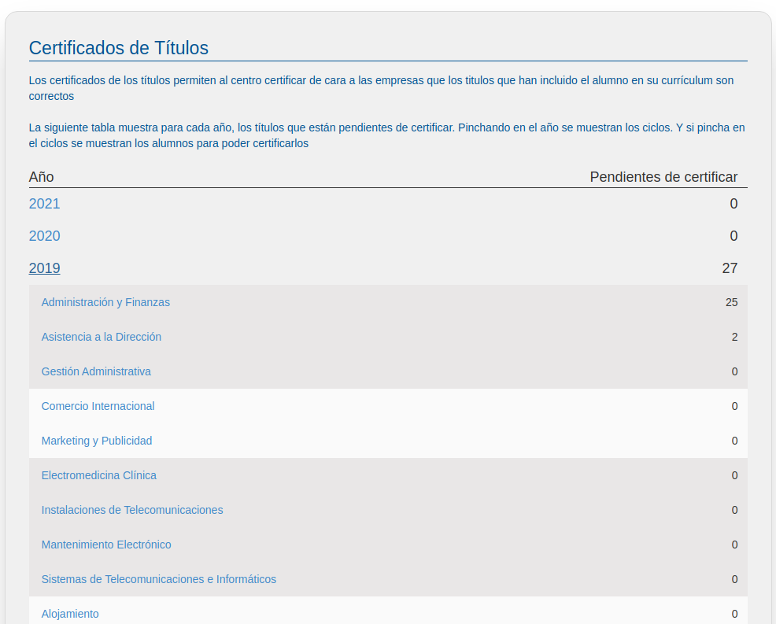
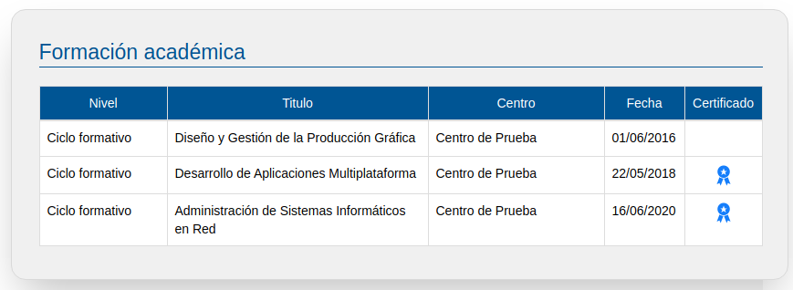

# Certificar título

En este apartado podremos certificar la veracidad de los títulos de formación profesional indicados en los CV del alumnado inscrito en EmpleaFP y que supuestamente hayan sido cursados en nuestro Centro de Formación.

Este sistema de certificación es para los ciclos de Formación Profesional cursados específicamente en su Centro Educativo.

La única utilidad de certificar es la siguiente: Permite que una empresa, cuando publica una oferta, pueda saber que el título que ha indicado un titulado, es verdad que lo tiene.

En esta pantalla podemos ver para cada año, los títulos (es decir los titulados que se han indicado que tienen un título en nuestro centro) que  faltan por certificar.

Si pulsamos en un año , se podrá ver , el desglose por ciclos de ese año.

Si por último pinchamos en un ciclo, aparece la siguiente ventana que nos permite certificar cada uno de los títulos.

Marcando en la primera columna, podemos certificar cada título de forma individual. Lo que realmente se está certificando es que si se registra un titulado con ese NIF/NIE/etc. con el título y año que se muestra en la pantalla, el sistema lo reconocerá como certificado por el centro. Es decir que el sistema no tiene en cuenta el nombre del titulado sino su NIF/NIE/etc.

Para terminar, en la siguiente pantalla se puede ver como se muestra la formación de un titulado, cuando se le certifica.

