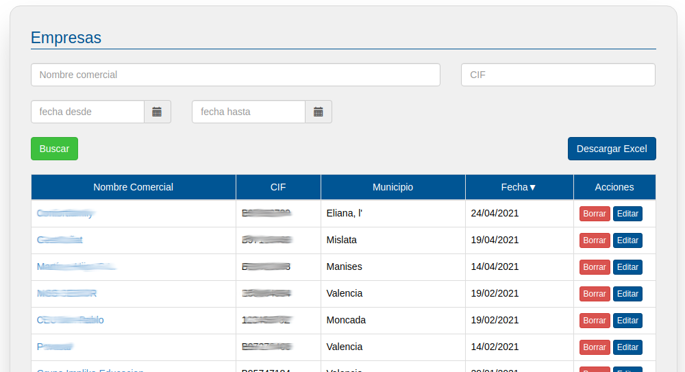
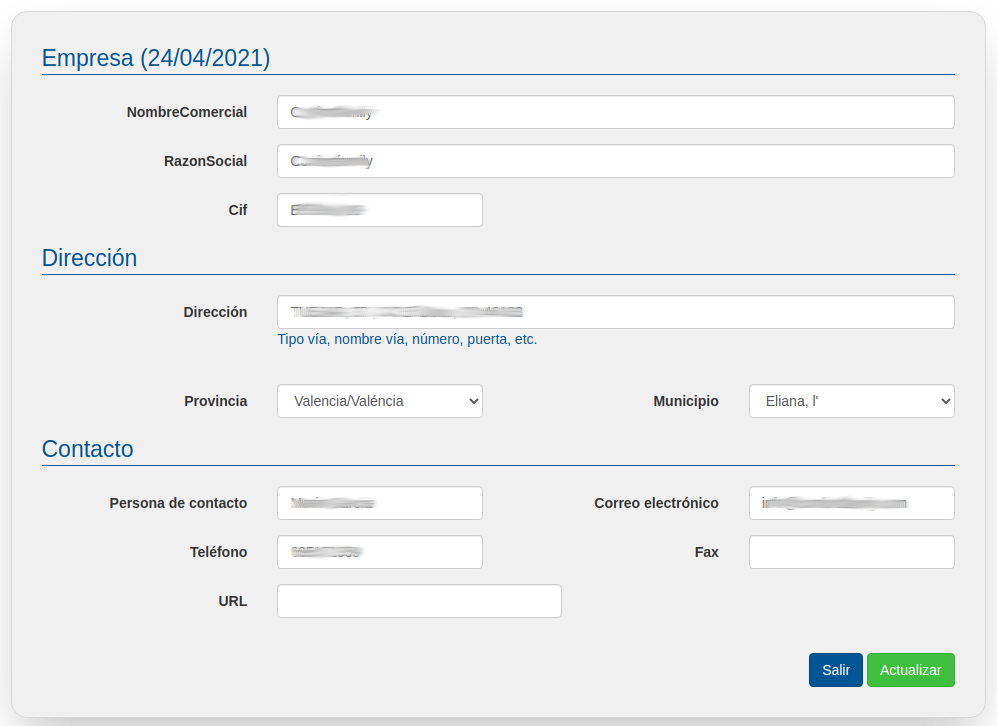

# Empresas

En este apartado, como ya hemos explicado para el resto de listas, podrás visualizar y buscar por razón social o CIF las empresas dadas de alta en EmpleaFP. 

También podrás editar sus datos pulsando su nombre o el botón editar correspondiente y eliminar completamente una empresa de la bolsa de empleo pulsando en su respectivo botón borrar.

Además, también podrás dar de alta nuevas empresas, lo cual es imprescindible hacer antes para poder generar nuevas ofertas de empleo, ya que no se pueden generar ofertas de empleo sin asignarlas previamente a una empresa ya inscrita.

Para introducir una nueva empresa haz clic en el botón nueva empresa, esto nos llevará a la siguiente pantalla donde deberemos completar la información de registro de dicha empresa. Todos los datos de empresa y dirección son obligatorios, en caso de no consignarlos la aplicación dará error y no podremos seguir con el registro. Sin embargo, los datos de contacto no son obligatorios y se pueden dejar en blanco, aunque recomendamos incluirlos por su utilidad.

Una vez que hayamos completado toda la información relevante pulsamos en guardar, la empresa nueva aparecerá ya en el listado como dada de alta por lo que ya podremos publicar ofertas provenientes de la misma.