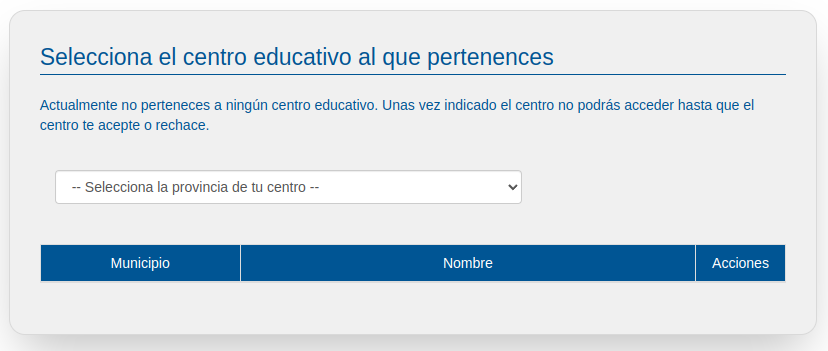

# Inscripción y acceso

## Inscribirse en la Bolsa de Empleo
Entra en la Web http://www.empleafp.com para acceder a la bolsa de empleo de EmpleaFP donde podrás inscribirte como profesor/a de Formación Profesional y así acceder a todas las funcionalidades propias de tu perfil, como gestionar ofertas de empleo, dar de alta empresas en la bolsa o modificar tus datos de cuenta entre otras.

Accederás a la siguiente pantalla:

En esta pantalla, pulsa en el botón "Nuevo usuario" crear una cuenta para acceder a la pantalla de creación de cuentas. 

En dicha pantalla, estará seleccionado por defecto el usuario titulado, para poder realizar la inscripción como profesor elige la opción "titulado" tal y como aparece en la imagen.

Completa todos los datos que se solicitan en la siguiente pantalla, incluyendo tu nombre, apellidos, correo electrónico y contraseña.

Por seguridad, la contraseña aparecerá en forma de asteriscos y habrás de introducirla dos veces para evitar errores.

Además, tendrás que aceptar los términos de uso y la política de privacidad para permitir a los administradores del portal el acceso a la información que publiques. Lee dichos términos pulsando en los textos resaltados en azul.

Una vez rellenes todos los datos pulsa en "Crear cuenta" para completar el registro.Si te falta algún dato para el registro, o la confirmación de contraseña no coincide, la aplicación dará error y no te permitirá continuar. Incorpora o corrige los datos vacíos o erróneos y pulsa de nuevo en el botón.

Si todo está correcto verás la siguiente pantalla, donde pulsando en inicia sesión podrás entrar a tu perfil en EmpleaFP.

## Acceder a la Bolsa de Empleo

Pulsa el enlace acceder en la parte superior de la pantalla si estás en la página inicial o si acabas de inscribirte y quieres iniciar la sesión pulsa en el botón inicia sesión, en ambos casos llegarás a la siguiente pantalla:

Introduce aquí el email que utilizaste como usuario para registrarte en EmpleaFP así como tu contraseña y pulsa en el botón entrar.
De este modo accederás al panel de gestión de profesorado, sin embargo, si es la primera vez que entras deberás adscribirte a tu Centro Educativo en la siguiente página:

Si tu centro no aparece pero pero si que está asociado a FPempresa? No te preocupes. Escríbenos a **soporte@empleafp.com** y enseguida lo damos de alta.

Pulsa en el nombre del Centro o en el botón pertenecer correspondiente para incorporarte como docente del mismo.
 
Ten en cuenta que no tendrás acceso hasta que dicho centro te valide. Esto sucederá cuando otro/a profesor ya validado para tu Centro de elección acepte tu candidatura; más adelante veremos como tú podrás también validar a otros usuarios/as. Ponte en contacto con alguno de tus compañeros/as para que realicen este trámite, ya que EmpleaFP **no** envía ningún correo para avisar de esta circunstancia.

atención!Si eres la primera persona que va a usar EmpleaFP en tu centro, deberás escribir a **soporte@empleafp.com **para que te aceptemos nosotros.

