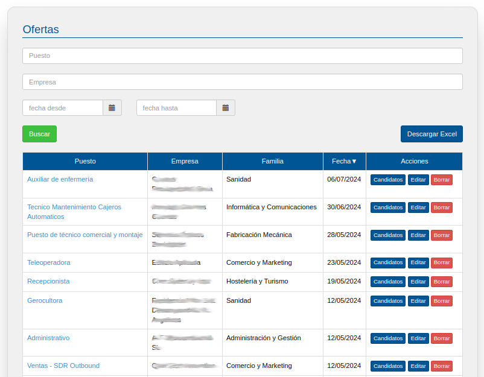
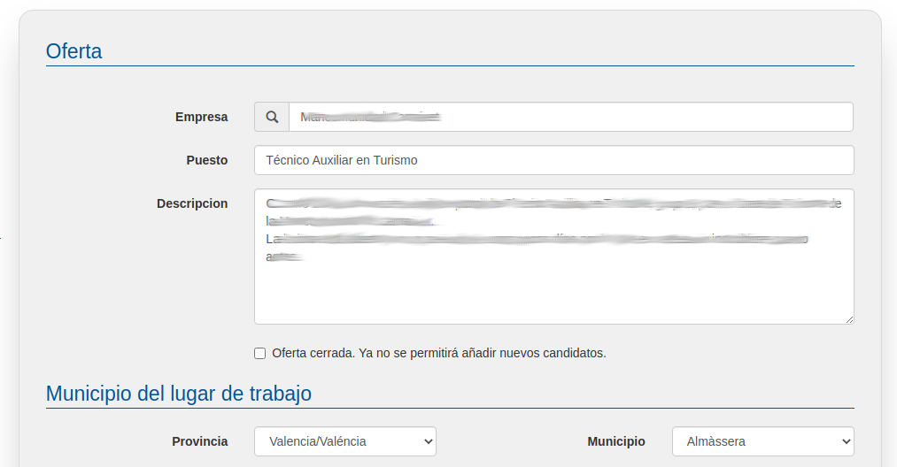
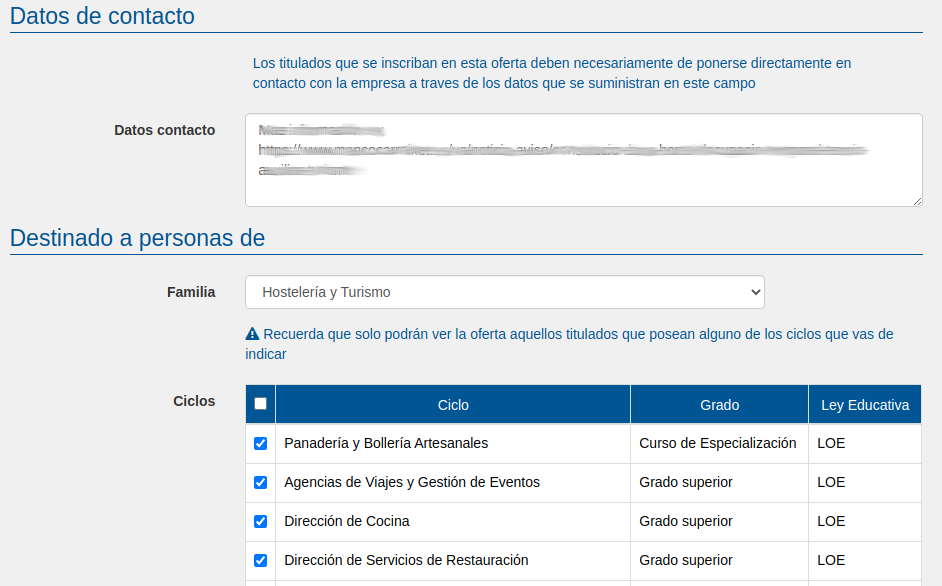
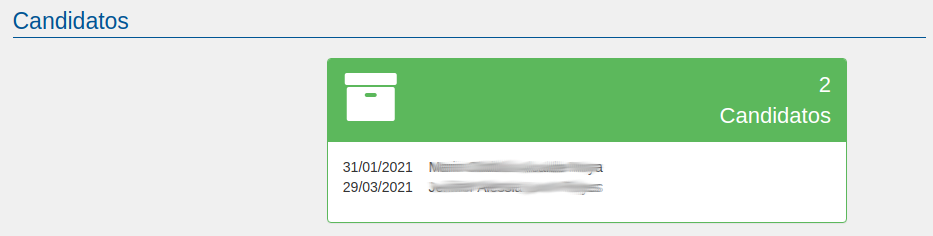

# Ofertas

El panel de ofertas nos permitirá tanto publicar nuevas ofertas como ver, listar y editar ofertas existentes.

En primer lugar, podremos buscar ofertas de trabajo publicadas por puesto de trabajo, empresa y por el rango de fechas en el que la oferta fue publicada.

También podremos editar una oferta haciendo clic en la descripción del puesto o en el botón editar correspondiente o eliminarla haciendo clic en el botón borrar. 

Con el botón "Candidatos" entraremos tambien en la oferta pero podremos ver directamente los candidatos

Al editar una oferta podemos modificar todos los datos que la describen:
- Empresa
- Puesto y descripción de funciones
- Provincia y municipio del puesto de trabajo
- Datos de contacto
- Familia y ciclos formativos por los que se filtrará a los titulados/as

En la imagen superior podemos ver los datos de la empresa, puesto, descripción y municipio del lugar de trabajo.

En la imagen superior podemos ver los datos de contacto y los ciclos a los que va destinado. El titulado no podrá ver los datos de contacto si no se inscribe en la oferta. De esa forma se puede llevar un control de cuánta gente usa EmpleaFP.

En la imagen superior podemos ver los candidatos que ha tenido la oferta. Es decir, los titulados que se han inscrito en ella.

Además de poder modificar dicha información simplemente cambiándola y haciendo clic en el botón actualizar, también podemos cerrar la oferta, habilitando la casilla oferta ya cerrada de modo que no podrán inscribirse más titulados/as.

Al añadir la oferta, EmpleaFP envía exclusivamente un correo a todos aquellos titulados que hayan indicado que poseen un título en el centro y que tengan algunos de los ciclos que se ha especificado en la oferta. Los titulados deberán inscribirse en la oferta para poder ver los datos de contacto y ser ellos mismos los que se pongan en contacto con la empresa.

