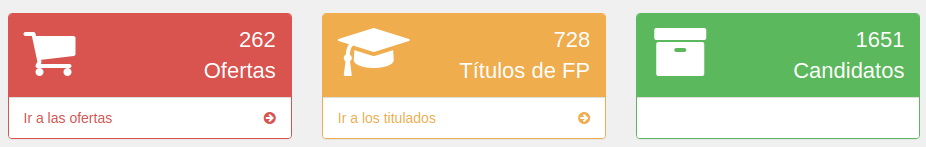

# Panel de control

Una vez validado nuestro perfil por un profesor/a ya incorporado a nuestro centro entraremos a la siguiente pantalla:

Desde aquí podremos realizar numerosas acciones a las que accederemos pulsando en los elementos del menú izquierdo.
Por otra parte, en el área central de esta página tenemos por un lado 3 gráficas informativas en las que se nos indicarán los siguientes datos clasificados todos ellos por la familia profesional a la que pertenecen:
- Ofertas publicadas
- Títulos inscritos en el portal de tu centro (Son realmente los titulados que se han inscrito, pero se indica título ya que un titulado puede tener más de un título)
- Candidatos/as inscritos en nuestras ofertas de empleo

Además, en la parte superior también tendremos un resumen con el número de ofertas, titulados/as y candidatos/as existentes. Pulsando respectivamente en ir a las ofertas e ir a los titulados nos llevará directamente a esas opciones de menú.

