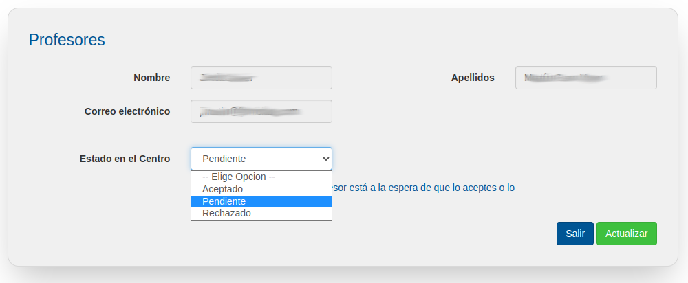

# Profesores

En este apartado puedes gestionar las cuentas de todos los profesores que están adscritos a tu Centro Educativo, incluyendo tu propia cuenta.
 
Estas funcionalidades son propias de la persona responsable de la administración de la cuenta del centro y en caso de no estar autorizado sólo deberías modificar tus datos si esto fuera necesario ya que todos los profesores de tu centro tienen los mismos permisos dentro de EmpleaFP

Específicamente se pueden realizar las siguientes acciones:
- Visualizar y buscar perfiles de otros usuarios del Centro Educativo
- Crear nuevos perfiles de usuarios del Centro Educativo
- Editar, actualizar y borrar perfiles de usuarios del Centro Educativo

Veamos cada una de estas funcionalidades:

## Visualizar y buscar perfiles de usuarios
Al entrar en el apartado profesores aparecerá la lista completa de las cuentas de usuarios adscritos al Centro Educativo. Además, el listado permite realizar búsquedas por nombre y apellidos. 

Si la lista de usuarios es larga, se generarán 2 o más páginas de listado a las que podrás acceder pulsando en el número correspondiente.

## Editar, actualizar y borrar perfiles de usuarios
En el listado de profesores/as podremos editar los usuarios de los/as docentes registrados en la bolsa de empleo de EmpleaFP bien pulsando en su nombre, resaltado en azul, bien pulsando en el botón editar de la línea correspondiente a dicho/a docente. Al pulsar en uno u otro iremos a la siguiente pantalla de edición:

En esta pantalla podremos modificar nombre, apellido y cuenta de email de la persona seleccionada, una vez modificados para que la modificación surta efecto haremos clic en actualizar.

Además, también en esta pantalla podremos validar o rechazar , los perfiles de profesores registrados en la cuenta de nuestro Centro Educativo. De este modo, si rechazamos el perfil de un docente no podrá entrar en la aplicación, mientras que si lo aceptamos podrá entrar en la aplicación y acceder a todas las funcionalidades descritas en este manual.

Atención!Cuando un nuevo profesor se de de alta en tu centro, deberá avisarte, entonces deberás entrar en esta pantalla y cambiar su estado de "Pendiente" a "Aceptado" para los casos en que desees que ese profesor gestione tambien la bolsa de empleo de tu centro. En caso contrario deberás indicar que su estado es "Rechazado".

