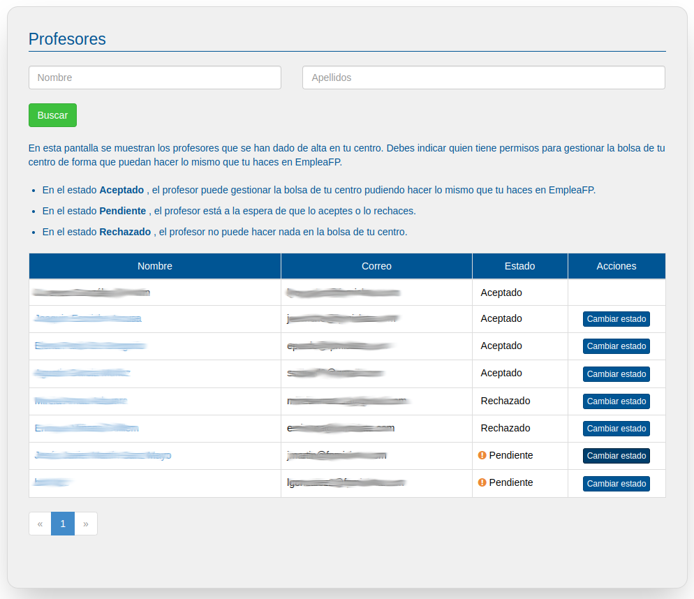

# Profesores

En esta pantalla se muestran los profesores que se han dado de alta en tu centro. Debes indicar quien tiene permisos para gestionar la bolsa de tu centro de forma que puedan hacer lo mismo que tu haces en EmpleaFP.

- En el estado **Aceptado** , el profesor puede gestionar la bolsa de tu centro pudiendo hacer lo mismo que tu haces en EmpleaFP.
- En el estado **Pendiente** , el profesor está a la espera de que lo aceptes o lo rechaces.
- En el estado **Rechazado** , el profesor no puede hacer nada en la bolsa de tu centro.

Para aceptar o rechazar a un profesor deberás pulsar sobre el botón "Cambiar estado". Una vez pulsado se mostrará la siguiente pantalla.

En esta pantalla deberás indicar el estado en la que estará el profesor (Aceptado, Pendiente o Rechazado) y pulsar el botón "Actualizar".

Atención! Cuando un nuevo profesor se de de alta en tu centro, deberá avisarte, entonces deberás entrar en esta pantalla y cambiar su estado de "Pendiente" a "Aceptado" para los casos en que desees que ese profesor gestione tambien la bolsa de empleo de tu centro. En caso contrario deberás indicar que su estado es "Rechazado".

Atención! Cuando un nuevo profesor se de de alta en tu centro, si su correo es el mismo que pusiste en el correo de los [datos del centro](#!centro.md), será automáticamente aceptado en tu centro. Pudiendo en ese caso gestionar la bolsa de empleo de tu centro.

