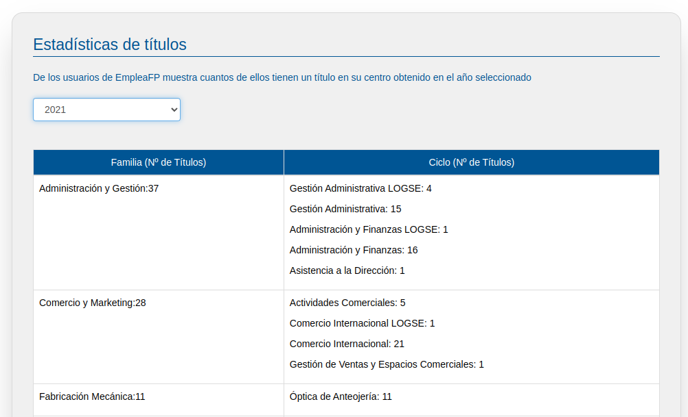
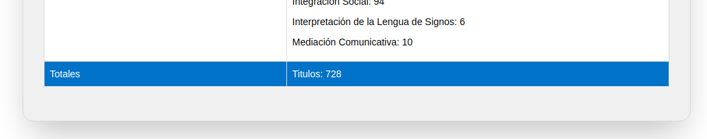

# Titulados

En este apartado podrás ver las estadísticas de cuantos titulados (Realmente n.º de titulos) tiene en cada familia y ciclo formativo.

Por defecto se muestra los del año actual pero se puede ver el de cualquier otro año o el total de todos los años.

En la parte inferior de la pantalla puede verse los totales del centro:

Destacar que aparece el nº titulados aunque dichos titulados hayan borrado su cuenta ya que se almacena el número total aunque se den de baja.
