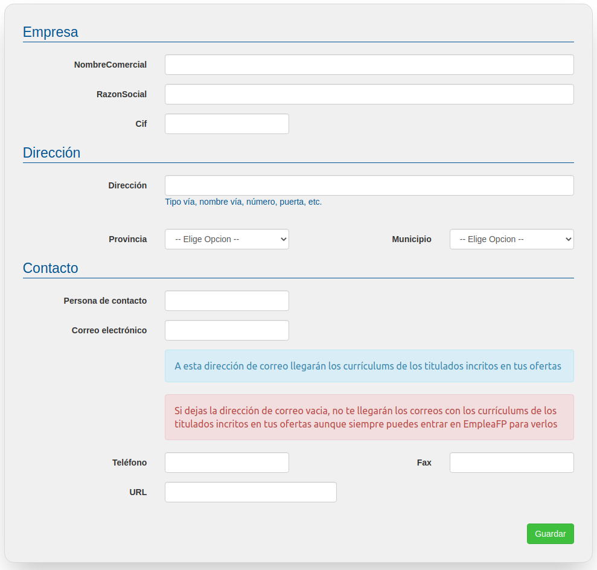

# Empresa

En este apartado podrás visualizar y/o modificar los datos correspondientes a tu Empresa al que estás adscrito/a, incluyendo su nombre comercial, razón social, CIF, URL, dirección y persona de contacto. 

En principio no debes de modificar nada en este panel de no ser que seas la persona responsable de la gestión de la cuenta de dicha empresa.

Si así fuera, bastaría con modificar los datos y después pulsar en el botón "Guardar".

Atención!Es importante que rellenes correctamente el campo de "Correo electrónico" ya que a esa dirección es donde te enviaremos los curriculums de los titulados que se inscriban en tus ofertas.

