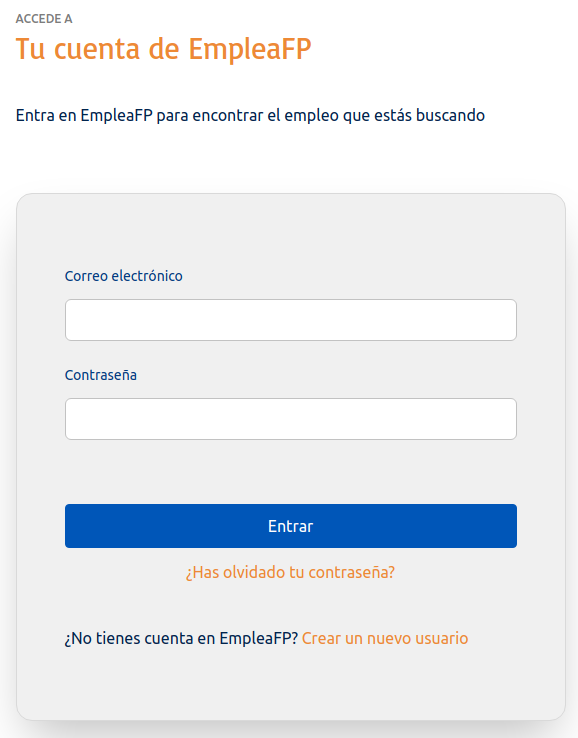

# Inscripción y acceso

## Inscribirse en la Bolsa de Empleo
Entra en la Web http://www.empleafp.com para acceder a la bolsa de empleo de EmpleaFP donde podrás inscribirte como representante de tu Empresa y así acceder a todas las funcionalidades propias de tu perfil, como crear y gestionar ofertas de empleo, crear nuevas cuentas personales para otras personas vinculadas a tu empresa o modificar tu cuenta de usuario/a. 

Si tu empresa ya está incluida en nuestra bolsa de empleo solicita que alguno de los compañeros/as que ya tienen un usuario creado generen tu perfil, si por el contrario tu empresa no está incluida en nuestra bolsa de empleo, para poder acceder a EmpleaFP por vez primera tendrás que crear un usuario nuevo, para ello basta con hacer clic en el botón "Nuevo usuario" de la página de inicio.

 
Por defecto viene preseleccionada la opción "titulado", para poder realizar la inscripción como responsable de empresa elige la opción "Empresa" tal y como aparece en la imagen.

Completa todos los datos que se solicitan en la siguiente pantalla, incluyendo tu nombre, apellidos, correo electrónico y contraseña.

Por seguridad, la contraseña aparecerá en forma de asteriscos y habrás de introducirla dos veces para evitar errores.
Además, tendrás que aceptar los términos de uso y la política de privacidad. Lee dichos términos pulsando en los textos resaltados en azul. 

Una vez rellenes todos los datos pulsa en "Crear cuenta" para completar el registro.Si te falta algún dato para el registro, o la confirmación de contraseña no coincide, la aplicación dará error y no te permitirá continuar. Incorpora o corrige los datos vacíos o erróneos y pulsa de nuevo en el botón.

Si todo está correcto verás la siguiente pantalla, donde pulsando en inicia sesión podrás entrar a tu perfil en EmpleaFP.

## Acceder a la Bolsa de Empleo

Pulsa el enlace acceder en la parte superior de la pantalla si estás en la página inicial o si acabas de inscribirte y quieres iniciar la sesión pulsa en el botón inicia sesión, en ambos casos llegarás a la siguiente pantalla:

Introduce aquí el email que utilizaste como usuario para registrarte en EmpleaFP así como tu contraseña y pulsa en el botón entrar.

