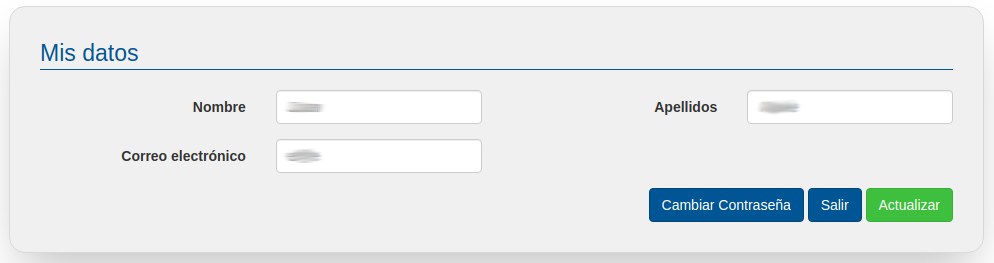

# Mis datos

En el apartado cuenta podemos configurar nuestro usuario, concretamente en el apartado mis datos podemos modificar nuestro nombre y apellidos así como nuestro usuario (dirección de correo electrónico) y también nuestra contraseña.

Al cambiar la contraseña se nos va a solicitar que volvamos a introducirla una segunda vez, esto evita que la tecleemos mal y luego no podamos acceder a nuestro panel de gestión.

