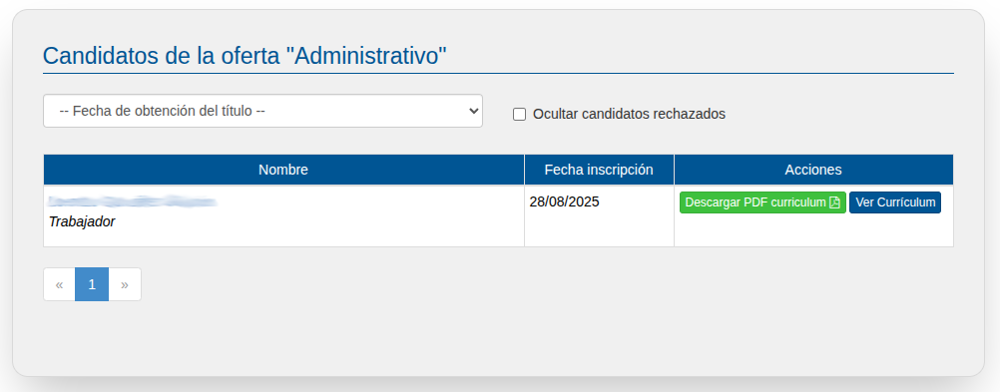

# Ofertas

Permite tanto publicar nuevas ofertas como ver, listar y editar ofertas existentes.

## Listado de Ofertas
En primer lugar, podemos listar ofertas de trabajo que ha publicado su empresa

## Nueva Oferta
Pulsado en el botón de "Nueva Oferta" podremos publicar una nueva oferta de trabajo.

Al crear una nueva oferta podemos modificar todos los datos que la describen:
  - Puesto y descripción de funciones
  - Cerrar la oferta para que no haya nuevos candidatos
  - Provincia y municipio del puesto de trabajo
  - Familia y ciclos formativos a los que va dirigida la oferta.

La oferta únicamente podrán verla aquellos titulados que posean alguno de los títulos que se indique en la oferta.

Una vez guardada será publicada automáticamente en EmpleaFP.

Si en su momento, en los datos de la empresa, rellenó el campo "Correo electrónico", recibirá por correo el currículum de cada uno de los candidatos de su oferta.

## Candidatos
Desde el listado de oferta, si pulsa en el puesto de la oferta o en el botón "Editar" vuelves a ver los datos de la oferta pero ahora con los datos de los candidatos.

Se puede el el número de candidatos y pulsando en "Ver los candidatos" se muestra la siguiente pantalla:

En esta pantalla se ven todos los candidatos que tiene la oferta. 

La aplicación permite filtrar los candidatos con los siguientes criterios:
- La fecha de obtención del título
- Mostrar sólo candidatos que tengan el título certificado por el centro
- Ocultar los candidatos que la propia empresa ha rechazado (En la siguiente pantalla se explica).

Si se pulsa sobre el nombre de un candidatos o en el botón de "Ver Currículum" se muestra el curriculum del candidato.

En esta pantalla se puede ver el currículum de un candidato.

Junto con los datos del curriculum hay otra serie de información importante.
  - Podemos rechazar un candidato. La utilidad de rechazar un candidato es poder mostrar en la pantalla anterior los candidatos no rechazados para simplificar la búsqueda.
  - La columna de "Certificado" indica que el centro educativo certifica que un alumno con ese NIF/NIE ha hecho ese título en ese año. 

 

