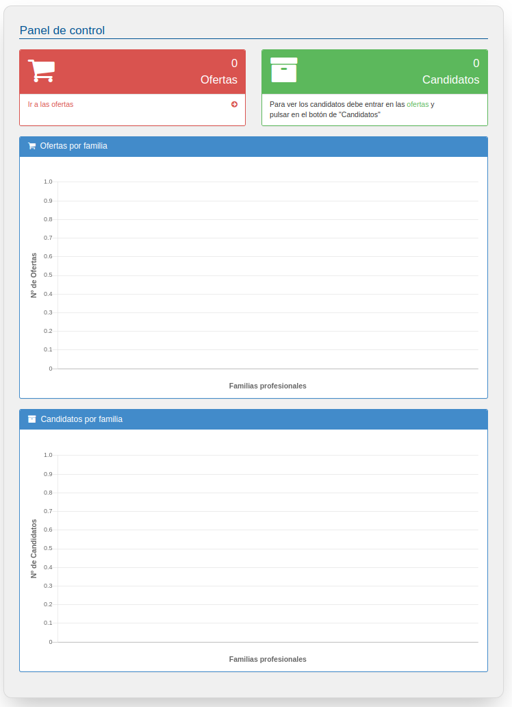

# Panel de control

Cuando entremos en EmpleaFP y una vez rellenado los datos de la empresa veremos la siguiente pantalla.

En la parte superior se muestra un resumen con el número de ofertas que ha publicado su empresa y el número de candidatos/as totales en todas las ofertas. Pulsando en "Ir a las ofertas" nos llevará directamente a esa opción de menú.

En el área central de esta página tenemos 2 gráficas informativas en las que se nos indicarán los siguientes datos clasificados por la familia profesional a la que pertenecen:
- Ofertas publicadas
- Candidatos/as inscritos en nuestras ofertas de empleo
