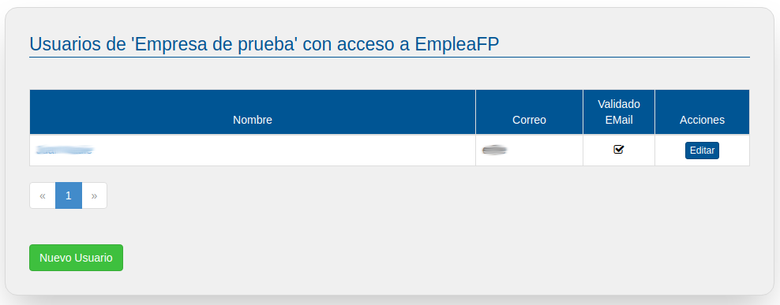
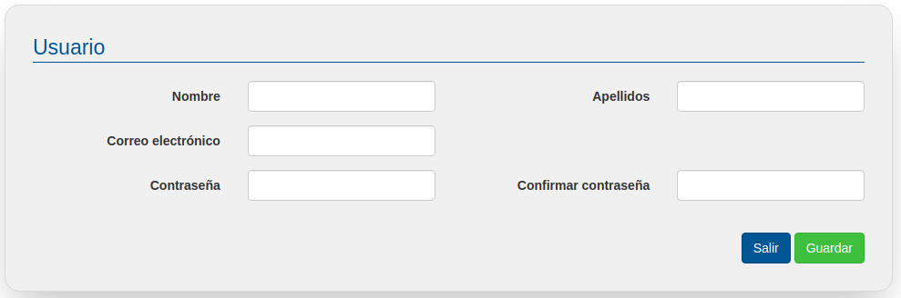
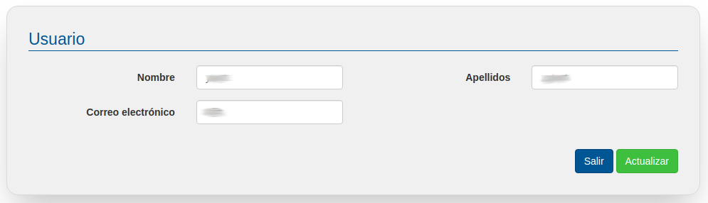

# Usuarios

En este apartado puedes gestionar las cuentas de todos los usuarios/as que pertenecen a tu Empresa, incluyendo tu propia cuenta.
 
Estas funcionalidades son propias de la persona responsable de la administración de la cuenta de la empresa y en caso de no estar autorizado/a sólo deberías modificar tus datos si esto fuera necesario ya que todos los usuarios de tu empresa tienen los mismos permisos en EmpleaFP.

Específicamente se pueden realizar las siguientes acciones:
- Visualizar y buscar perfiles de usuarios de tu Empresa
- Crear nuevos perfiles de usuarios de tu Empresa
- Editar, actualizar y borrar perfiles de usuarios de tu Empresa

Veamos cada una de estas funcionalidades:

## Visualizar y buscar perfiles de usuarios
Al entrar en el apartado usuarios aparecerá la lista completa de las cuentas de usuarios de tu Empresa. Además, el listado permite realizar búsquedas por nombre y apellidos. 

Si la lista de docentes es larga, se generarán 2 o más páginas de listado a las que podrás acceder pulsando en el número correspondiente.

## Crear nuevos perfiles de usuarios
En la misma pantalla en la que listamos los perfiles de los usuarios registrados podemos acceder a la creación de un nuevo perfil de usuario pulsando en el botón de "Nuevo usuario".

Se nos mostrará la siguiente pantalla donde podremos generar un nuevo perfil usuario introduciendo los siguientes datos: nombre, apellidos, email (que será su nombre de usuario) y contraseña, que se solicita dos veces para evitar errores tipográficos:

Atención!Para dar de alta un usuario, deberás haber  pedido su permiso para darle de alta e indicarle que  acepta las condiciones del servicio y la política de privacidad.

Este usuario docente estará automáticamente validado para trabajar con la bolsa de empleo de FPempresa para su Empresa.

## Editar, actualizar y borrar perfiles de usuarios
En el listado de usuarios podremos editar los usuarios registrados de nuestra empresa en EmpleaFP bien pulsando en su nombre, resaltado en azul, bien pulsando en el botón editar de la línea correspondiente a dicho/a usuario. Al pulsar en uno u otro iremos a la siguiente pantalla de edición:

En esta pantalla podremos modificar nombre, apellido y cuenta de email de la persona seleccionada, una vez modificados para que la modificación surta efecto haremos clic en actualizar.

