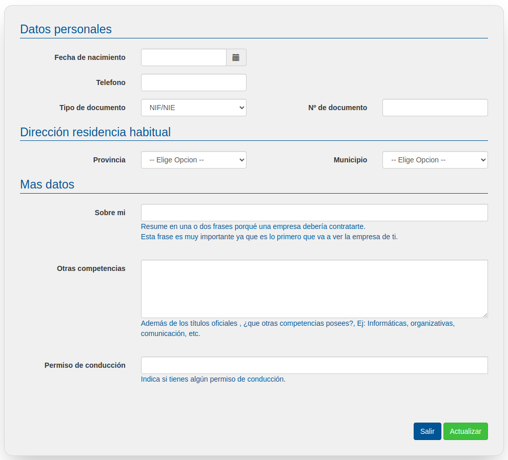

# Datos personales

Es momento de incorporar tus datos personales: fecha de nacimiento, teléfono, documento de identidad...

Es importante que rellenes correctamente los campos "Tipo de documento" y "Nº de documento", ya que los usará el centro para certificar el título que posees.

En el apartado más datos, es importante que rellenes también todos los campos. El primero, "Sobre mí", ha de ser un texto muy corto que sintetice tus principales cualidades, habilidades, conocimientos o características.

En otras competencias podemos incorporar todo tipo de conocimientos y habilidades (idiomas, características de personalidad, diversos conocimientos, habilidades…).

Por último indicaremos los permisos de conducir de los que disponemos mediante su nomenclatura y separados por comas: p.ej. B, C+E, BTP..

Una vez hayas completado todos los datos pulsa en el botón "Actualizar". La aplicación te llevará directamente al resumen de tu perfil.

