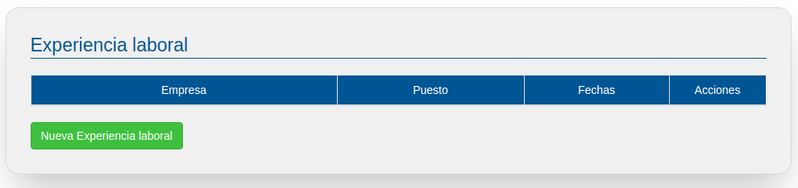
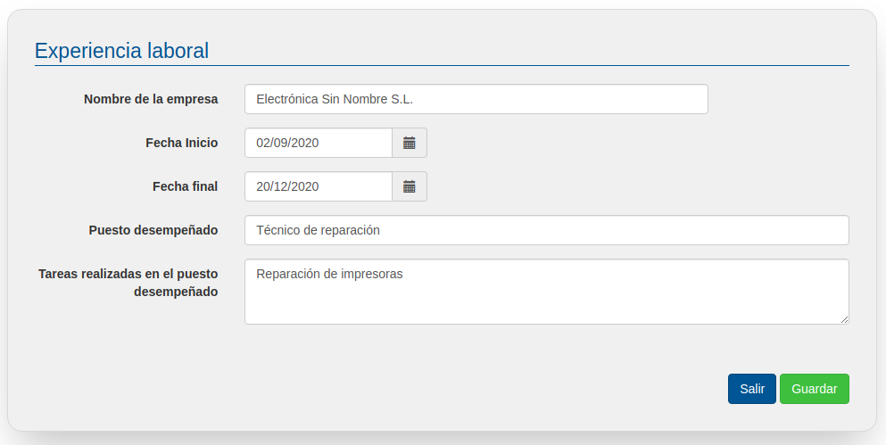
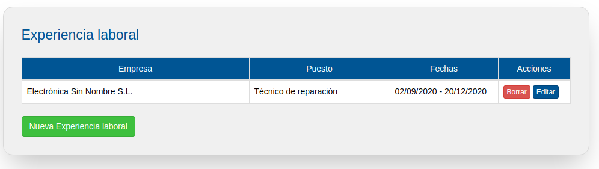

# Experiencia laboral

En este apartado podrás incluir tu experiencia en trabajos y/o voluntariado (especifica esto de algún modo).

Para añadir una nueva experiencia laboral, pulsa en el botón de "Nueva experiencia laboral".

En la pantalla de nueva  experiencia laboral habrás de introducir el nombre de la empresa, fecha de inicio y fin de la relación laboral, el puesto desempeñado y las tareas o funciones que llevabas a cabo en el mismo.

Una vez rellenado los datos  pulsa el botón "Guardar".

Ten en cuenta los siguientes consejos para completar la información:

  - Usa tu vida laboral o tus contratos para ajustar las fechas de forma que sean lo más precisas posible
  - Indica el puesto que realmente has desempeñado, en caso de ser oficial, indícalo también, p.ej. Oficial de 2ª Soldador Naval.
  - No dejes vacías las funciones, pero tampoco aportes información innecesaria: sintetiza lo más importante o destacado que has hecho en cada trabajo realizado (maquinaria, equipo o funciones poco habituales o muy demandadas…)

Una vez introducidas tu experiencia laboral, ésta aparecerá en un listado en el que podrás editar / borrar cada una.

