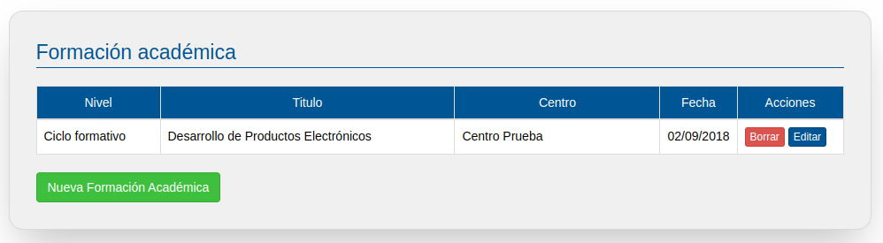

# Formacion Academica

En este apartado podrás incluir los cursos de Formación Profesional, Universitaria o de otro tipo que hayas realizado. Es importante que todos los datos los completes correctamente y que no te dejes fuera ninguna formación relevante. 

Para añadir una nueva formación académica, pulsa en el botón "Nueva formación académica".

Una vez pinchado , podrás ver la siguiente pantalla para rellenar tu formación académica.

Elige de la lista el tipo de Formación que quieres añadir a tu CV. Si se trata de una formación universitaria u otra formación (cursos de idiomas, cursillos, formación para el empleo…) habrá que indicar tecleando el nombre del centro de formación, el título y la fecha de obtención.

Si se trata de un Ciclo de Formación Profesional, aparecerán los campos del centro educativo, familia, grado , ciclo, etc.

Una vez rellenado los datos  pulsa el botón guardar.

Volverás a la pantalla anterior donde se mostrará la nueva formación académica que has añadido. Ahora tendrás la opción de editar o borrar cada una de estas formaciones pulsando en los correspondientes botones.

