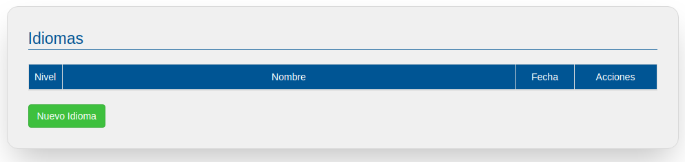
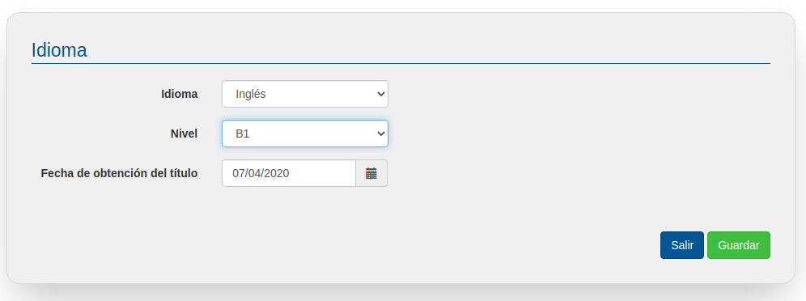
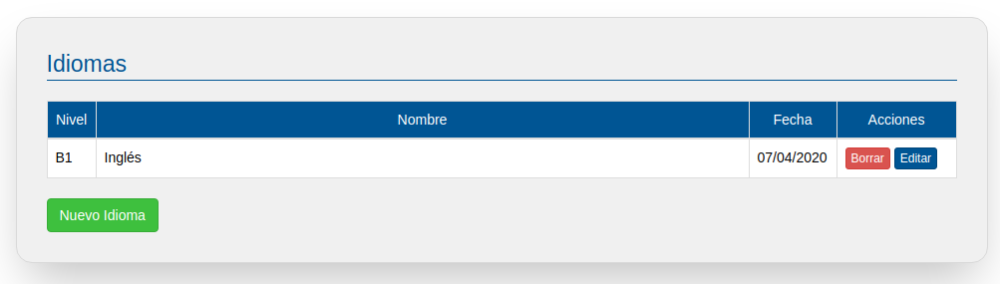

# Idiomas

En este apartado se pueden incorporar los diferentes idiomas que tengamos acreditados mediante algún título oficial. 

Para añadir una nueva titulación de un idioma, pulsa en el botón de "Nueva Idioma".

Podemos elegir entre alemán, francés e inglés, y en caso de ser otro indicarlo a través del teclado.

Además indicaremos el nivel del certificado obtenido. Los niveles indicados son los de tipo europeo A1, B2, C1… por lo que es importante que conozcas bien las equivalencias entre tus títulos y dichos niveles, si tienes dudas pregunta en tu centro de formación o en un servicio de orientación laboral.

Si tienes conocimientos de idiomas no acreditados siempre puedes añadir esta información en el apartado de datos Personales / otras competencias.

Una vez introducidas tu titulación de un idioma, ésta aparecerá en el listado en el que podrás editar / borrar cada una.

