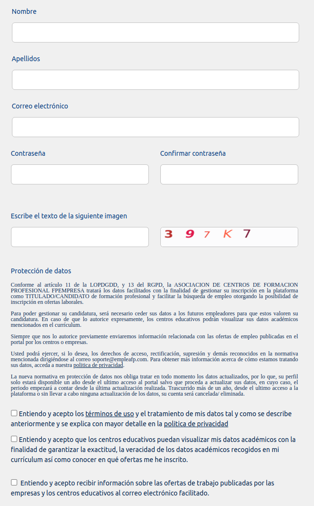

# Inscripción y acceso

## Inscribirse en la Bolsa de Empleo
Entra en la Web http://www.empleafp.com para acceder a la bolsa de empleo de EmpleaFP donde podrás inscribirte como alumno/a de Formación Profesional, generar y actualizar tu curriculum vitae, CV, e inscribirte a las ofertas

Accederás a la siguiente pantalla:

En esta pantalla, pulsa en el botón "Nuevo usuario" crear una cuenta para acceder a la pantalla de creación de cuentas.
 
En dicha pantalla, estará seleccionado por defecto el usuario titulado, debes dejar esa opción tal y como aparece en la siguiente imagen.

Completa todos los datos que se solicitan en la siguiente pantalla, incluyendo tu nombre, apellidos, correo electrónico y contraseña.

Por seguridad, la contraseña aparecerá en forma de asteriscos y habrás de introducirla dos veces para evitar errores.

Además, tendrás que aceptar los términos de uso y la política de privacidad para permitir a los administradores del portal el acceso a la información que publiques. Lee dichos términos pulsando en los textos resaltados en azul. También deberás aceptar que los centros en los que has obtenido un título puedan acceder a tus datos académicos para poder verificar dicha información de cara a las empresas. Por último deberías aceptar que te enviemos correos cuando lleguen ofertas relacionadas con tus títulos.

Una vez rellenes todos los datos pulsa en "Crear cuenta" para completar el registro.Si te falta algún dato para el registro, o la confirmación de contraseña no coincide, la aplicación dará error y no te permitirá continuar. Incorpora o corrige los datos vacíos o erróneos y pulsa de nuevo en el botón.

Si todo está correcto verás la siguiente pantalla, donde pulsando en inicia sesión podrás entrar a tu perfil en EmpleaFP.

## Acceder a la Bolsa de Empleo

Pulsa el enlace acceder en la parte superior de la pantalla si estás en la página inicial o si acabas de inscribirte y quieres iniciar la sesión pulsa en el botón inicia sesión, en ambos casos llegarás a la siguiente pantalla:

Introduce aquí el email que utilizaste como usuario para registrarte en EmpleaFP así como tu contraseña y pulsa en el botón entrar.
De este modo accederás a una pantalla para rellenar tus datos personales.

