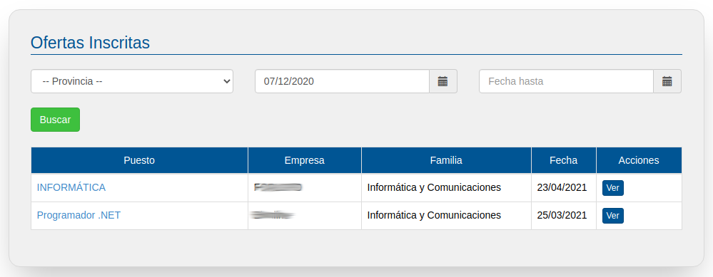
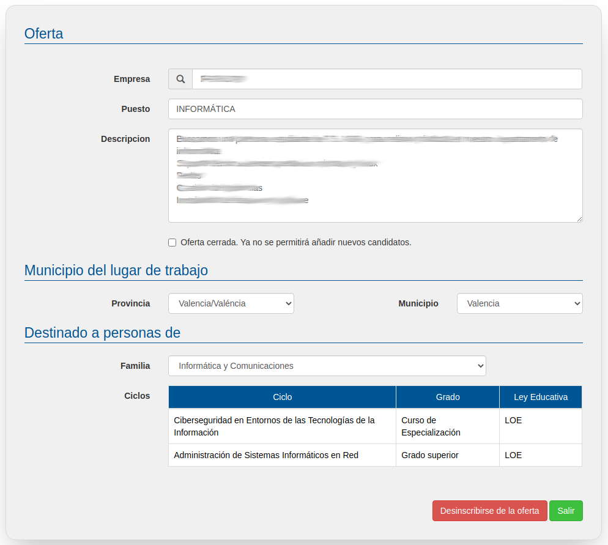

# Ofertas Inscritas

Una vez te has apuntado a una o varias ofertas puedes ver el histórico de las ofertas en las que estás inscrito/a en la opción de menú ofertas inscritas.

En la siguiente pantalla aparecen listadas las ofertas a las que te has inscrito.

Haciendo clic sobre las ofertas podrás acceder a sus respectivas fichas técnicas donde puedes darte de baja en la oferta pulsando el botón "Desinscribirse de la oferta".

