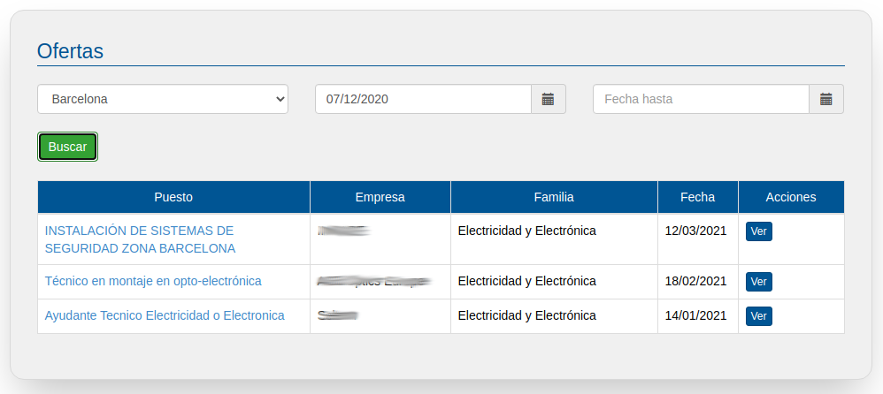
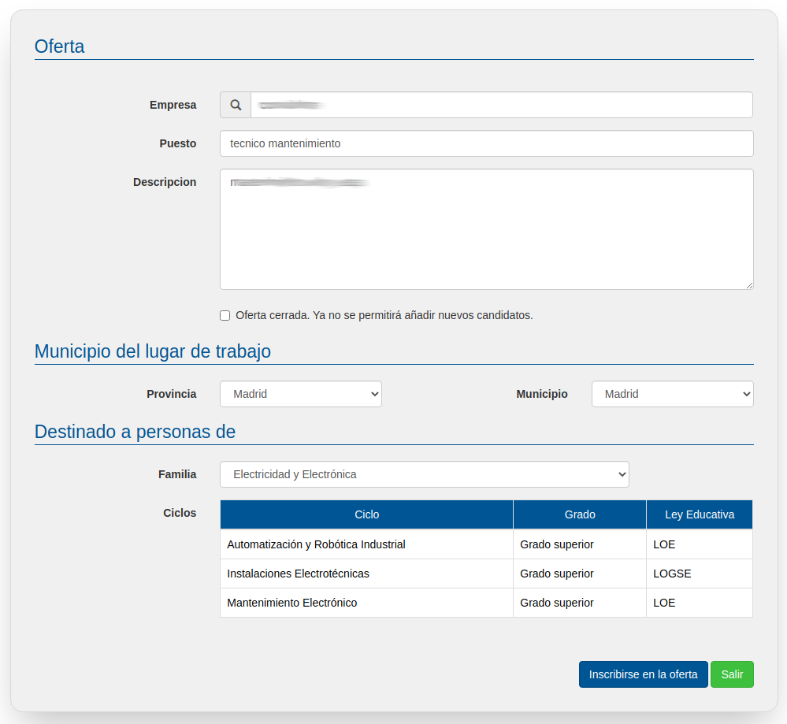
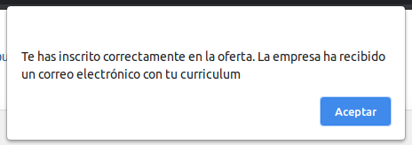
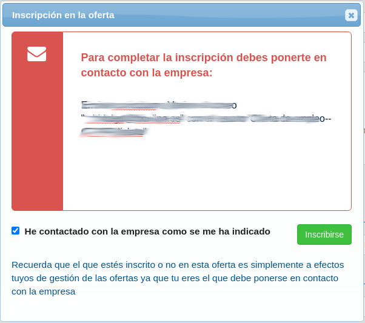

# Todas las ofertas

Una vez que tienes tu CV correctamente incorporado a la bolsa de empleo de EmpleaFP es el momento de revisar las ofertas de empleo que hay disponibles y así poder apuntarte a las que te interesen.

Para visualizar las ofertas publicadas accede en el menú izquierdo a todas las ofertas, en este apartado se listan las ofertas de empleo disponibles para tu perfil formativo, es decir, todas aquellas ofertas en las que se solicita una persona que como tú tenga determinado Grado de Formación Profesional.

Para filtrar las ofertas puedes elegir la provincia en la que se oferte el empleo y también por la fecha de publicación de dicha oferta.

En el listado podrás ver información sobre el puesto, empresa y familia profesional, si te interesa la oferta podrás ver su ficha técnica con más información pulsando en el puesto o en el botón "Ver" de cada una. 

Si te interesa la oferta inscríbete pulsando en inscribirse en la oferta.

Si la oferta la ha publicado una empresa se te mostrará un mensaje como el siguiente:

En este caso ya no debes hacer nada más. La empresa ha recibido tu curriculum por correo.

Por otro lado si la oferta de empleo la ha publica tu centro educativo, se mostrará el siguiente mensaje:

Atención!En este caso , eres tu el que debes ponerte en contacto con la empresa tal y como se indique en la pantalla.
